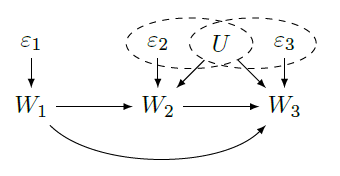
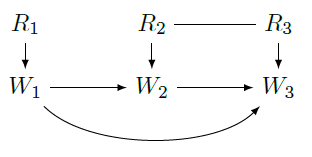
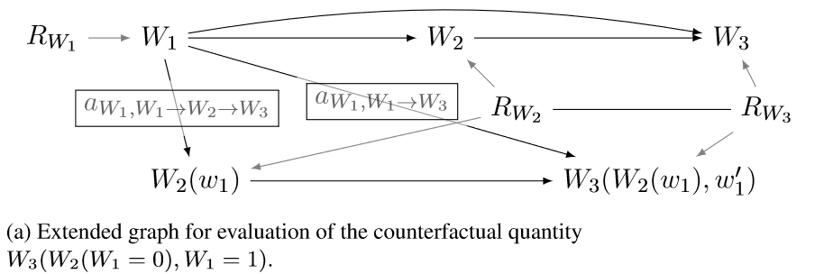

```{r setup, include=FALSE}
options(htmltools.dir.version = FALSE)
library(ggplot2)
library(gganimate)
library(dagitty)
library(DiagrammeR)
library(knitr)
opts_chunk$set(echo = FALSE, fig.width = 10, fig.height = 10 * .618)

```


# The Identification Problem is Solved

Given a graph and a causal query, there are algorithms to determine whether that query is estimable. If so, the algorithm returns an estimand. 

# Pearl's recipe

1. Commit to a graph
2. Specify a query
3. Determine whether query is identified
4. If so, determine estimand
5. Specify statistical model for estimand
6. Fit the model

If the query is not identified? Compute bounds!

---

## Previous work

- Balke and Pearl (1994) demonstrate that the noncompliance graph implies an optimization problem with a linear objective and linear constraints
- Balke implemented a general vertex enumeration algorithm to solve this symbolically to get bounds on a causal effect in terms of the observed probabilities

## Our contributions

- Describe a class of problems (graphs plus causal queries) that are alway linear
- Extend the concept of intervention sets to allow for arbitrarily complex counterfactual queries
- Develop a general algorithm for translating the graph+query into a linear program
- Prove that the resulting bounds are valid and tight
- Implement it all in a user friendly R package

---


# Response function representation

 

These are equivalent representations of the assumptions. When $W_1, W_2, W_3$ are binary, all possible values of the response function varibles can be enumerated. 

The values of the response function variables determine the manner in which the variables are determined from their parents.

---

# Response functions


Let $\mathbf{R} = (R_{w_1}, \ldots, R_{w_n})$ represent the set of response-function random variables for all observed variables in the model. Given a particular value of $\mathbf{r}$, values of any variable $W_i \in \mathbf{W}$ is functionally determined according to the recursive function:

$$w_i = f_{W_i}(\mathbf{r}) = f_{W_i}(f_{W_{i1}}(\mathbf{r}), \ldots, f_{W_{ik}}(\mathbf{r}), r_{W_i})$$

where $\{W_{i1}, \ldots, W_{ik}\}$ are the parents of $W_i$.

---

# Relating observed probabilities to the response variables

Any observed probability can be related to the distribution of response function variables as follows:

$$P\{w_1=W_1; \ldots; W_{n}=w_{n}\} = \sum_{\mathbf{r}: \forall_{j \in 1,\ldots,n} [w_j = f_{W_j}(\mathbf{r})]} P\{\mathbf{R} = \mathbf{r}\}$$

That is, 

1. cycle through all possible values of $\mathbf{r}$,
2. recursively evaluate the response functions, and 
3. keep track of the values that match the outcomes in the probability statement


---


# Incorporating interventions



Define sets of interventions $A$ and a function $f^A$ that can be recursively evaluated under those intervention sets. 

__Key extension__: Intervention sets depend on the full path from the potential outcome to the variable intervened upon. 

---

# Describing the causal query

The functions $f$ and $f^A$ now give us the recipe for obtaining observations given $\mathbf{r}$ and $A$. 

For any factual or counterfactual probabilities we have

$$P\{W_{i_1}(A_{w_{i_1}}) = w_1, \ldots, W_{i_p}(A_{i_p}) = w_{i_p}, W_{j_1} = w_{j_1}, \ldots, W_{j_o} = w_{j_o}\} = \sum_{\mathbf{r} \in \mathbf{\Gamma}} P(\mathbf{r}).$$

where

$$\mathbf{\Gamma} = \{\mathbf{r}: \forall_{j \in O} [w_j = f_{w_j}(\mathbf{r})] \mbox{ and }  \forall_{i \in P} [w_i = f^A_{w_i}(\mathbf{r}, i)]\}.$$

---

# Recap

- Every observed probability $p_j$ can be written in terms of probabilities of the response function variables $P(\mathbf{R} = \mathbf{r})$
- The causal query $Q$ can also be written in terms of the $P(\mathbf{R} = \mathbf{r})$
- The goal is to find the extremum of $Q$ in terms of the $p_j$
- When is this feasible? 

---

# Guaranteeing linearity 

## The right side 

- In graphs where all observed variables have a common unmeasured cause, we have $P(r_i, r_j) \neq P(r_i)P(r_j)$
- Necessary to use $\prod_{i = 1} ^ n 2^{2^{k_i-1}}$ parameters to specify the distribution of $\mathbf{R}$, say $\mathbf{q}$
- This implies that the observed probabilities are linear functions of the response variables: $\mathbf{p} = \overline{P} \mathbf{q}$ for some matrix $\overline{P}$.

## The left side

- Unconfounded arrows from left to right, but no children of the intervention set $A$ are on the left
- Observed probabilities conditional on all variables on the left side suffice
- This preserves the linearity of the constraints and the causal query.

---

# The optimization problem now

Minimize (maximize): $Q$ 

Subject to: 

$$
\begin{eqnarray*}
\sum q_j &=& 1 \\
\overline{P} \mathbf{q} = \mathbf{p} \\
q_j, p_i & \geq & 0
\end{eqnarray*}
$$

and optionally some additional linear constraints specified by the user, e.g., monotonicity, there are no defiers of treatment assignment.

---


Consider the objective $Q = p_1 q_1 + p_2 q_2$, and constraints $q_1, q_2 \geq 0$; $q_1 \leq 0.75$; $q_2 \leq -0.5 q_1 + 0.75$.

```{r, gganimate = list(nframes = 250, fps = 10)}

swag_animation <- function(p1, p2) {
  
  feas.region <- expand.grid(q1 = seq(0, 1, by = .01), q2 = seq(0, 1, by = .01))
  feas.region <- subset(feas.region, q1 <= .75 & q2 <= -.5 * q1 + .75)
  marble <- unlist(feas.region[sample(1:nrow(feas.region), 1), ])
  # marble <- data.frame(q1 = .4, q2 = .4) 
  Qinit <- c(marble[1] * p1 + marble[2] * p2)
  slope <- c(-p1 / p2)
  res.out <- NULL
  stepsize <- ifelse(runif(1) < .5, .01, -.01)
  j <- 1
  while(TRUE) {
    
    int.in <- Qinit / p2 - stepsize * j * p2 - stepsize * j * p1 * p1 / p2
    q1.in <- seq(0, 1, by = .01)
    q2.in <- int.in + slope * q1.in
    Q.in <- (p1 * q1.in + p2 * q2.in)[1]
    
    if(all(!(q2.in <= -.5 * q1.in + .75 & q1.in <= .75 & q1.in >= 0 & q2.in >= 0))) {
      break
    }
    
    st.arrow <- marble
    end.arrow <- st.arrow - stepsize * 20 * c(p1, p2)
    
    res.out <- rbind(res.out, data.frame(intercept = int.in, 
                                         slope = slope, Q.cand = Q.in,
                                         index = j, arr.x.0 = st.arrow[1], arr.y.0 = st.arrow[2], 
                                         arr.x.1 = end.arrow[1], arr.y.1 = end.arrow[2], opt = FALSE))
    j <- j + 1
    
  }
  
  res.out$marble.x <- marble[1]
  res.out$marble.y <- marble[2]
  
  marble <- marble - stepsize * c(p1, p2)
  
  rbind(do.call(rbind, lapply(1:nrow(res.out), function(i){
    res <- res.out[1, ]
    res$opt <- FALSE
    res$index <- res$index + i
    res
  })), 
  res.out, do.call(rbind, lapply(1:nrow(res.out), function(i){
    res <- res.out[nrow(res.out), ]
    res$opt <- TRUE
    res$index <- res$index + i
    res
  })))
  
}

set.seed(20200122)

linedata <- do.call(rbind, lapply(1:20, function(i) {
  
  swag_animation(runif(1, -.95, .95), runif(1, -.95, .95))
  
}))
linedata$index <- 1:nrow(linedata)

ggplot(data = data.frame(q1 = c(0, .75, .75, 0, 0), q2 = c(0, 0, .375, .75, 0)), 
       aes(x = q1, y = q2)) + 
  geom_polygon(alpha = .3) + xlim(c(-.5, 1.5)) + ylim(c(-.5, 1.5)) + theme_bw() + 
  geom_point(data = linedata, aes(x = marble.x, y = marble.y)) + 
  xlab("p1") + ylab("p2") + 
  geom_abline(data = linedata, aes(intercept = intercept, slope = slope, color = opt)) + 
  geom_segment(data = linedata, aes(x = arr.x.0, y = arr.y.0, xend = arr.x.1, yend = arr.y.1), arrow = arrow()) + 
  transition_time(index)
#anim_save(file = "linear-prog.gif")


```

---

# Conclusion

Package and preprint at https://sachsmc.github.io/causaloptim and on CRAN/ArXiv

- Preprint describes the approach formally and proves validity/tightness of bounds 
- Balke's program has been useful for statisticians
- This project takes a few steps towards making it more broadly accessible and easier to use
- Draw DAGs interactively, specify queries with text, get bounds as R functions and LaTeX code


---

class: inverse, center, middle

# Demo


