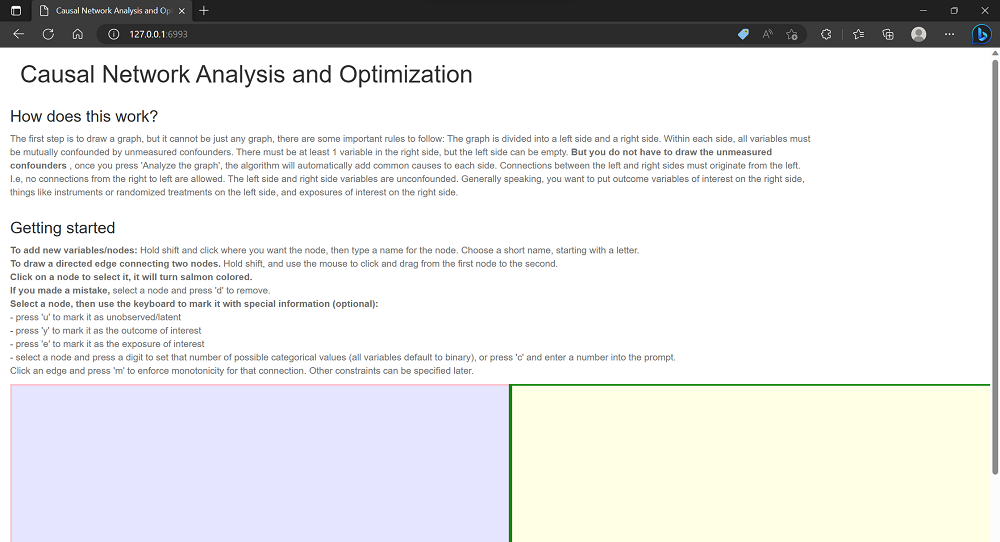
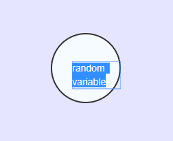
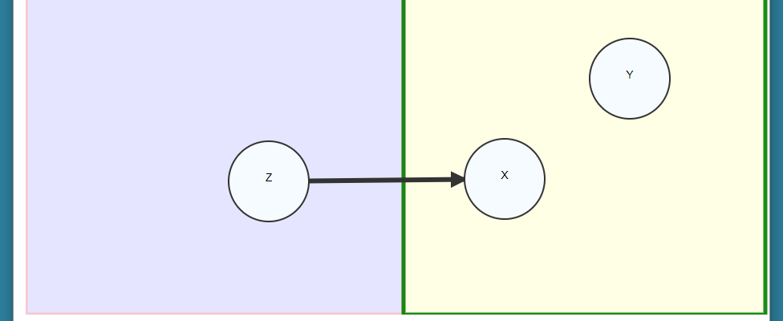
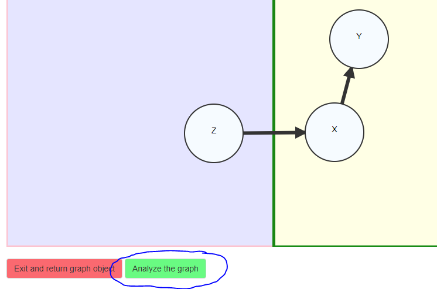
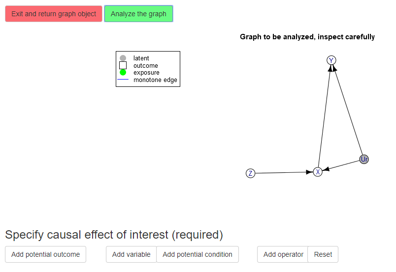

# How to use the causaloptim Shiny app to analyze graphs

``` r

library(causaloptim)
```

Run the Shiny application like so. The result is assigned to an objected
called `results` so that you can save the results that are produced in
the web interface.

``` r

results <- specify_graph()
```

A new window in your system’s default web browser is opened with the
following interface:



Startup

The instructions at the top provide details on how to specify the graph.
The graph is divided into a left side and a right side. There is no
confounding allowed between the left and right sides. All variables on
the right side are confounded. Connections between the left and right
sides must originate from the left. I.e, no connections from the right
to left are allowed. On the left side, arbitrary connections are allowed
and the model assumes that all nodes are observed and connected. On the
right side, unmeasured variables are allowed, and the procedure assumes
unmeasured confounding between all nodes. These restrictions ensure that
the problem can be solved analytically using linear optimization.

In the main window below the text, Shift+click to add nodes. When a node
is added, you are prompted to give it a name. Make sure that you use a
valid R variable name, but without underscores. This means it cannot
start with a number, and cannot contain spaces, underscores or special
characters. Single capital letters are good choices, possibly with
trailing numbers.



Naming nodes

Click on an existing node to select it, and shift+click on a node to
change the name. Shift+drag to connect nodes. Remember than no edges may
go from the right side to the left side. Click a node to select and then
press ‘u’ to mark it as unobserved/latent. Select a node and press a
digit to set that number of possible categorical values (all variables
default to binary), or press ‘c’ and enter a number into the prompt.
Click to select nodes/edges and press ‘d’ to remove. If there are
problems selecting nodes, try restarting your browser.



Connections

Once we have our graph specified, we can optionally make some
annotations. You may specify the outcome of interest, and the exposure
of interest. Select the outcome node and press ‘y’ to mark it as the
outcome of interest, and then select the exposure node and press ‘e’ to
mark it as the exposure of interest. The default causal contrast is the
total effect. The exposure will be colored blue, and the outcome colored
red.



Final graph

We now have a graph specified that is ready to be analyzed. Optionally,
click an edge and press ‘m’ to enforce monotonicity for that connection.
If you are ready to analyze the object click on the “Press to analyze
the graph button”. The program interprets the graph, converts it to an
`igraph` object with annotations, and prints the result from R. Inspect
the resulting graph carefully so that you understand what is being
analyzed. Note that if a side contains at least two variables then a
confounder has been automatically added for them.

## Specifying the causal effect of interest

The next step is to use the text box to specify the causal effect of
interest. In our current example, we are interested in the causal risk
difference in Y comparing X = 1 to X = 0, i.e., Y(X = 1) - Y(X = 0). The
optimizer will compute bounds for the expected value of this quantity.



Interpreted graph

Use the text box to describe your causal effect of interest. The effects
must be of the form

    p{V11(X=a)=a; V12(X=a)=b;...} op1 p{V21(X=b)=a; V22(X=c)=b;...} op2 ...

where `Vij` are names of variables in the graph, `a, b` are
corresponding values, and `op` are either `-` or `+`. You can specify a
single probability statement (i.e., no operator). Note that the
probability statements begin with little p, and use curly braces, and
items inside the probability statements are separated by `;`. The
variables may be potential outcomes which are denoted by parentheses.
Variables may also be nested inside potential outcomes. Pure
observations such as `p{Y = 1}` are not allowed if the left side
contains any variables. If the left side contains any variables, then
they mush be ancestors of the intervention set variables (or the
intervention variables themselves). All of the following are valid
effect statements:

    p{Y(X = 1) = 1} - p{Y(X = 0) = 1}
    p{X(Z = 1) = 1; X(Z = 0) = 0}
    p{Y(M(X = 0), X = 1) = 1} - p{Y(M(X = 0), X = 0) = 1}

Back to our example, we specify the effect as

    p{Y(X = 1) = 1} - p{Y(X = 0) = 1}

then click the “parse” button to fix the effect.

## Specifying constraints (optional)

Once the causal effect of interest has been specified, you may
optionally specify some constraints. Click the button to start the
constraint interface.

Here you can specify potential outcomes to constrain by writing the
potential outcomes, values of their parents, and operators that
determine the constraint (equalities or inequalities). In our example,
we can specify monotonicity of the instrument Z by defining the
constraint X(Z = 1) $`\geq`$ X(Z = 0):

    X(Z = 1) >= X(Z = 0)

then click parse.

## Computation of the bounds

Once you have inspected the graph, specified the causal effect, and
understand what is being analyzed, press the final button to compute the
bounds.

Note that the computation may take a significant amount of time.

The results are summarized in plain text. The bounds are expressed as
the minimum/maximum of a series of expressions involving the conditional
probabilities of the observed variables. For more details on the method
see [this
paper](https://www.tandfonline.com/doi/full/10.1080/10618600.2022.2071905).
The final button allows you to return all of the objects back to the R
environment and store them in `results`.

The `results` object contains the graph, the parameterization and
interpretation of the graph in terms of the variables and parameters,
the bounds and log information about the optimization procedure, and an
R function that implements the bounds:

``` r

names(results)
#> [1] "graphres"       "obj"            "bounds.obs"     "constraints"   
#> [5] "effect"         "boundsFunction"

print(results$bounds.obs)
#> lower bound =  
#> MAX {
#>   p00_0 - p00_1 - p10_1 - p01_1
#> }
#> ----------------------------------------
#> upper bound =  
#> MIN {
#>   1 - p10_1 - p01_0
#> }
#> 
#> A function to compute the bounds for a given set of probabilities is available in the x$bounds_function element.

print(results$boundsFunction)
#> function (p00_0 = NULL, p00_1 = NULL, p10_0 = NULL, p10_1 = NULL, 
#>     p01_0 = NULL, p01_1 = NULL, p11_0 = NULL, p11_1 = NULL) 
#> {
#>     lb <- pmax(p00_0 - p00_1 - p10_1 - p01_1)
#>     ub <- pmin(1 - p10_1 - p01_0)
#>     if (any(ub < lb)) {
#>         warning("Invalid bounds! Data probably does not satisfy the assumptions in the DAG!")
#>     }
#>     data.frame(lower = lb, upper = ub)
#> }
```

The results object can also be used to numerically simulate the bounds.
Try using the `simulate_bounds` function.

``` r

sim <- simulate_bounds(results$obj, results$bounds.obs, nsim = 100)
head(sim)
#>     objective bound.lower bound.upper
#> 1  0.11072239  -0.2765626   0.4145571
#> 2  0.04677063  -0.3380446   0.4131181
#> 3 -0.20689850  -0.4887614   0.1605880
#> 4  0.14317449  -0.2369513   0.3885858
#> 5  0.02464152  -0.3451034   0.3450640
#> 6  0.09175714  -0.2020024   0.3795258
```

We also provide a helper function to print the bounds as latex
equations. Use the `latex_bounds` function.

``` r

cat(latex_bounds(results$bounds.obs$bounds, results$obj$parameters))
```

``` math
 
 \mbox{Lower bound} =   P(X = 0, Y = 0 | Z = 0) - P(X = 0, Y = 0 | Z = 1) - P(X = 1, Y = 0 | Z = 1) - P(X = 0, Y = 1 | Z = 1) 
 
```
``` math
 
 \mbox{Upper bound} =   1 - P(X = 1, Y = 0 | Z = 1) - P(X = 0, Y = 1 | Z = 0) 
 
```

Please sends any bugs or feedback to <sachsmc@gmail.com> or file an
issue on <https://github.com/sachsmc/causaloptim> .
