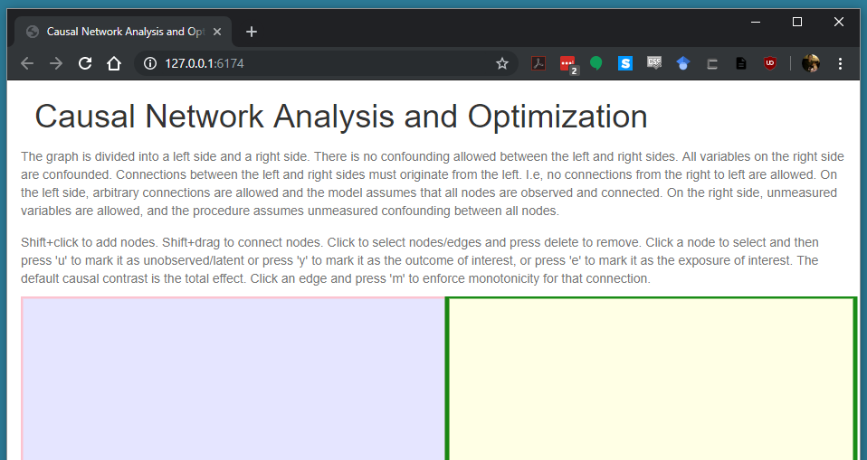
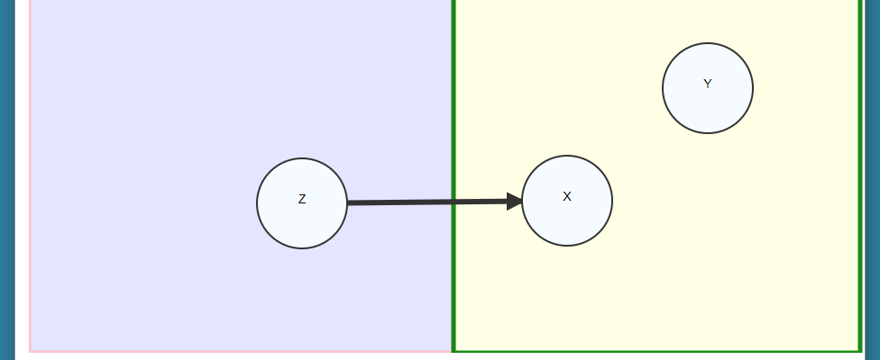
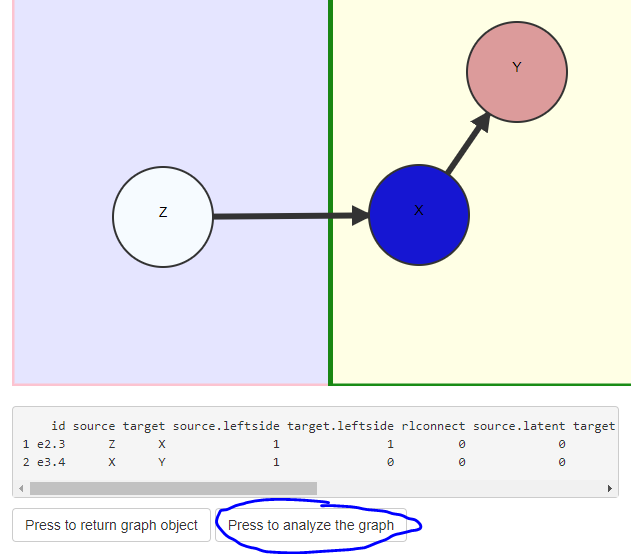
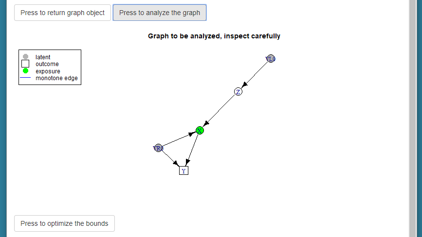
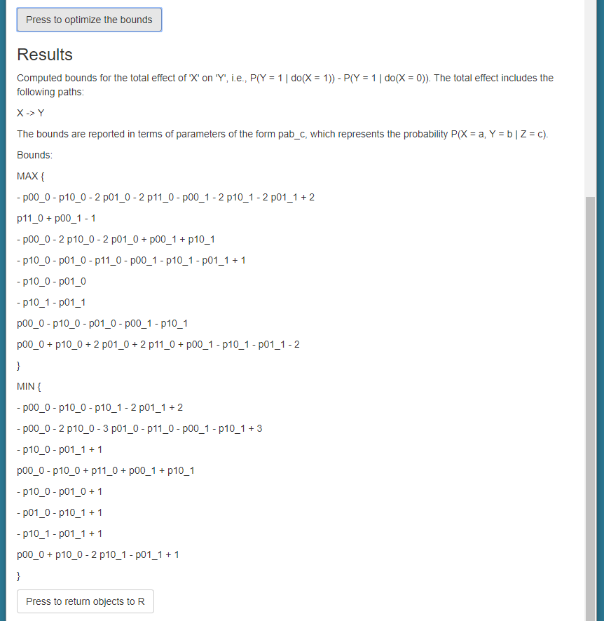
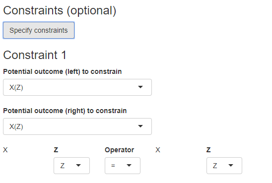

```{r, include = FALSE}
knitr::opts_chunk$set(
  collapse = TRUE,
  comment = "#>"
)

results <- readRDS("example.RData")
```

```{r setup}
library(causaloptim)
```

Run the Shiny application like so. The result is assigned to an objected called `results` so that you can save the results that are produced in the web interface. 

```{r, eval = FALSE}
results <- specify_graph()
```

A new window in your system's default web browser is opened with the following interface: 



The instructions at the top provide details on how to specify the graph. The graph is divided into a left side and a right side. There is no confounding allowed between the left and right sides. All variables on the right side are confounded. Connections between the left and right sides must originate from the left. I.e, no connections from the right to left are allowed. On the left side, arbitrary connections are allowed and the model assumes that all nodes are observed and connected. On the right side, unmeasured variables are allowed, and the procedure assumes unmeasured confounding between all nodes. These restrictions are sufficient to ensure that the problem can be solved analytically using linear optimization. 

In the main window below the text, Shift+click to add nodes. When a node is added, you are prompted to give it a name. Make sure that you use a valid R variable name. This means it cannot start with a number, and cannot contain spaces or special characters. Single capital letters are good choices, possibly with trailing numbers. 


Click on an existing node to select it, and shift+click on a node to change the name. Shift+drag to connect nodes. Remember than no edges may go from the right side to the left side. Click a node to select and then press 'u' to mark it as unobserved/latent. Click to select nodes/edges and press delete to remove. If there are problems selecting nodes, try restarting your browser.  



Once we have our graph specified, we can optionally make some annotations. You must specify the outcome of interest, and the exposure of interest. Select the outcome node and press 'y' to mark it as the outcome of interest, and then select the exposure node and press 'e' to mark it as the exposure of interest. The default causal contrast is the total effect. The exposure will be colored blue, and the outcome colored red. 



We now have a graph specified that is ready to be analyzed. Optionally, click an edge and press 'm' to enforce monotonicity for that connection. If you are ready to analyze the object click on the "Press to analyze the graph button". The program interprets the graph, converts it to an `igraph` object with annotations, and prints the result from R. Inspect the resulting graph carefully so that you understand what is being analyzed. 

## Specifying the causal effect of interest

The next step is to use the text box to specify the causal effect of interest. In our current example, we are interested in the causal risk difference in Y comparing X = 1 to X = 0, i.e., Y(X = 1) - Y(X = 0). The optimizer will compute bounds for the expected value of this quantity. 



Use the buttons to describe your causal effect of interest. The following buttons are available to make this specification:

- **Add potential outcome**: This button adds one of the variables as a potential outcome that depends on one or more of its parents. Click the button, and then select the outcome from the dropdown list. In this example, we click and select the "Y" variable. 
   + Once you have selected a potential outcome, you must specify what it depends on, which will be indicated by the parentheses. An outcome can depend on a _variable_, that is, one of its parents in the graph whose value is fixed to 0 or 1, or on a _potential condition_ which is a potential variable that itself depends on the value of one of its parents. 
- **Add variable**: This button adds a selector for the parents of the outcome in the current row, and 0 or 1 for the value of that variable. In our example we set the variable X to 1.
- **Add potential condition**: This button adds a selector for the parents of the outcome in the current row, but unlike the variable, these are potential outcomes as well. The condition for the potential outcome depend on the parents of the variable selected, two levels up from the outcome in the current row. 
- **Add operator**: This button terminates the selection of variables in the current row, and adds a new row that allows you to select "+" or "-", which is the operator that is used to combine with the next row. In our example, we click and select "-" for the difference. 
- **Reset**: Clears all of the outcomes and operators. 

If the potential outcome has multiple parents, you can press the add variable or add potential condition button as many times as is needed to define your effect. Continue adding variables, specifying their conditions, and make sure that all rows are separated by an operator. 

Our specified effect now looks like this: 




## Specifying constraints (optional)

Once the causal effect of interest has been specified, you may optionally specify some constraints. Click the button to start the constraint interface. 



Here you can choose potential outcomes to constrain by selecting the potential outcomes, values of their parents, and operators that determine the constraint (equalities or inequalities). In our example, we can specify monotonicity of the instrument Z by defining the constraint X(Z = 1) $\geq$ X(Z = 0). 


## Computation of the bounds

Once you have inspected the graph, specified the causal effect, and understand what is being analyzed, press the final button to compute the bounds. 

The results are summarized in plain text. The bounds are expressed as the minimum/maximum of a series of expressions involving the conditional probabilities of the observed variables. For more details on the method see the paper that doesn't exist yet. The final button allows you to return all of the objects back to the R environment and store them in `results`. 

The `results` object contains the graph, the parameterization and interpretation of the graph in terms of the variables and parameters, the bounds and log information about the optimization procedure, and an R function that implements the bounds: 

```{r}
names(results)

print(results$boundsFunction)
```


The results object can also be used to numerically simulate the bounds. Try using the `simulate_bounds` function. 


```{r}
sim <- simulate_bounds(results$obj, results$bounds.obs, nsim = 100)
head(sim)
```

Please sends any bugs or feedback to michael.sachs@ki.se. 


