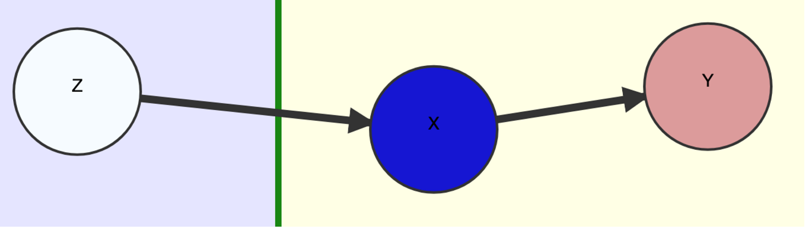
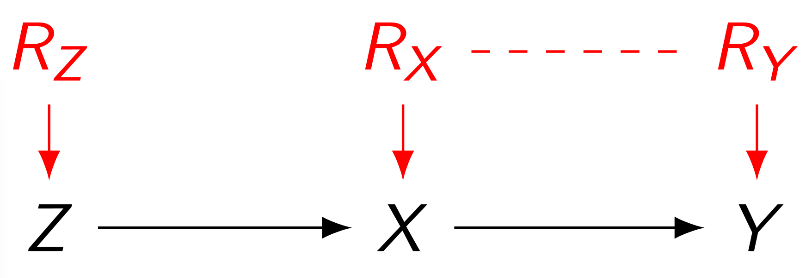

```{r, include = FALSE}
knitr::opts_chunk$set(
  collapse = TRUE,
  comment = "#>"
)
```

```{r setup}
library(causaloptim)
```

# What is `causaloptim`?

In summary, `causaloptim` computes *symbolic tight bounds* on causal effects. 
Suppose we have a causal graph $G$ in which we want to estimate an effect $\text{ACE}(X\rightarrow Y)$. 
If there is unmeasured confounding of this effect, then it cannot be determined. 
However, we can still try to find good bounds on it! 

Let's pretend for a while that the confounding was in fact measured, so we have an estimate of its distribution $q$. 
Then, given $q$, the effect $\text{ACE}_{q}(X\rightarrow Y)$ is identifiable. 
Now, even though we don't actually know $q$, we surely know *something* about it; it needs to be consistent with the structure of $G$, so it satisfies some constraint, say $q\in\mathcal{A}$. 
With no further assumptions, $\text{ACE}_{q}(X\rightarrow Y)$ is valid w.r.t. $G$ if and only if we have $q\in\mathcal{A}$, so finding tight bounds on $\text{ACE}(X\rightarrow Y)$ becomes a constrained optimization problem; simply find the extrema of $\{\text{ACE}_{q}(X\rightarrow Y):q\in\mathcal{A}\}$. 

For a given estimate of the distribution $p$ of our *measured* variables, we could try a large number of simulations and numerically approximate the bounds, but can we actually solve the problem analytically to get closed form expressions of the bounds in terms of $p$? 
For a certain class of problems, it turns out we can! 
This is precisely what `causaloptim` does, and this post will highlight some of its inner workings and recent efficiency improvements. 
For a tutorial on how to get started using `causaloptim`, have a look at [this post](https://sachsmc.github.io/causaloptim/articles/shinyapp.html).

# Background

Back in 1995, [Balke & Pearl]^[https://ftp.cs.ucla.edu/pub/stat_ser/R213-B.pdf] showed how to do this in a classic example of an experiment with potential non-compliance. 
More on that shortly, but in summary they showed how to translate their causal problem into a linear programming one and leverage tools from linear optimization to compute the bounds. 
Balke even wrote a command line program in C++ that computes them, given such a linear program (LP) as input. 
His program has been used successfully by researchers in causal inference since then, but has had a few issues preventing it from wider adoption among applied researchers. 

`causaloptim` was written to solve these problems. 
It can handle the generalized class of problems defined in [Sachs & Jonzon & Gabriel & Sjölander]^[https://www.tandfonline.com/doi/full/10.1080/10618600.2022.2071905]. 
It removes the burden of translating the causal problem into an LP and has an intuitive graphical user interface that guides the user through specifying their DAG and causal query. 
It has until version `0.7.1` used Balke's code for the optimization. However, for non-trivial instances of the generalized class that `causaloptim` handles, the original optimization algorithm has not been up to the task.

# Efficiency matters!
Let's time the following simple enough looking multiple instrument problem.

```{r Multiple_Instruments_Image, echo = FALSE, fig.align = "center", out.width = "40%", fig.cap = "Benchmark Example. Multiple Instruments."}
knitr::include_graphics("TwoIVs.png")
```
```{r Multiple_Instruments_Code, eval = TRUE}
library(causaloptim)
library(igraph)
b <- graph_from_literal(Z1 -+ X, Z2 -+ X, Z2 -+ Z1, Ul -+ Z1, Ul -+ Z2, X -+ Y, Ur -+ X, Ur -+ Y)
V(b)$leftside <- c(1, 0, 1, 1, 0, 0)
V(b)$latent <- c(0, 0, 0, 1, 0, 1)
V(b)$nvals <- c(2, 2, 2, 2, 2, 2)
E(b)$rlconnect <- c(0, 0, 0, 0, 0, 0, 0, 0)
E(b)$edge.monotone <- c(0, 0, 0, 0, 0, 0, 0, 0)
obj <- analyze_graph(b, constraints = NULL, effectt = "p{Y(X = 1) = 1} - p{Y(X = 0) = 1}")
```
Using `causaloptim` version `0.7.1` to bound $\text{ACE}(X\rightarrow Y)$ we got (with a 3.3 GHz Quad-Core Intel Core i5; your mileage may vary) 
```{r Running_Time_Pre, eval = FALSE}
system.time(oldbnds <- optimize_effect(obj))
#>     user  system  elapsed 
#> 31093.57   47.02 61368.22
```
Note the times (in seconds)! 😱 
Our CPU spent almost $9$ hours working on this! 🤖
And we spent more than $17$ hours waiting! 😴 
Correctness is not enough; having to wait until the next day is a bad user experience. 
Using `causaloptim` version `0.8.0` however, we get 
```{r Running_Time_Post, eval = FALSE}
system.time(newbnds <- optimize_effect_2(obj))
#>  user  system  elapsed 
#> 0.139   0.001    0.140
```
Now this is acceptable! 😊 Of course, we need to verify that the results are the same. It is difficult to see upon visual inspection that they are the same, because the vertices are returned in a different order (and there are lots of them). Instead we can randomly generate some probability distributions that satisfy the graph, and compute the bounds and compare the results. First, we create the R functions that compute the bounds: 

```{r, include = FALSE}

oldbnds <- readRDS("MIV-bounds-result.RData")
newbnds <- optimize_effect_2(obj)

```


```{r, eval = TRUE}
eval_newbnds <- interpret_bounds(newbnds$bounds, obj$parameters)
eval_oldbnds <- interpret_bounds(oldbnds$bounds, obj$parameters)
```

Then, we create a distribution by first randomly generating the counterfactual probabilities, and then calculating the observable probabilities by using the constraints implied by the DAG (which live in the `constraints` element of `obj`).

```{r, eval = TRUE}
sim.qs <- rbeta(length(obj$variables), .05, 1)
sim.qs <- sim.qs / sum(sim.qs)

names(sim.qs) <- obj$variables

inenv <- new.env()
for(j in 1:length(sim.qs)) {
    
    assign(names(sim.qs)[j], sim.qs[j], inenv)
    
}
res <- lapply(as.list(obj$constraints[-1]), function(x){
    x1 <- strsplit(x, " = ")[[1]]
    x0 <- paste(x1[1], " = ", x1[2])
    eval(parse(text = x0), envir = inenv)
})

params <- lapply(obj$parameters, function(x) get(x, envir = inenv))
names(params) <- obj$parameters
```

Then we pass the probabilities to the bounds functions and compare: 

```{r, eval = TRUE}
do.call(eval_newbnds, params) 
do.call(eval_oldbnds, params)
```

Success!

This improvement was achieved by modernizing a key back-end optimization algorithm and implementation. To see how it fits into the bigger picture, let's first see how `causaloptim` sets up the optimization problem.

# How does `causaloptim` work?
Given a DAG $D$, causally relating a set $\mathcal{V}$ of measured binary variables, suppose we can bipart $\mathcal{V}$ so that all association between the two parts is causal and directed from one part (which we call $\mathcal{L}$) to the other (called $\mathcal{R}$), and we want to determine the effect  $\text{ACE}(X\rightarrow Y)$ of some variable $X$ on a variable $Y\in\mathcal{R}$. 
As a guiding example, let's follow along the original one given by Balke & Pearl.

```{r User_Input_DAG_D, echo = FALSE, fig.align = "center", out.width = "40%", fig.cap = "Original Example: User Input DAG $D$."}

```
Since we assume nothing apart from the macro-structure $\mathcal{L}\rightarrow\mathcal{R}\ni Y$, we must augment $D$ with a "worst case" scenario of confounding among *each* variable *within* the parts $\mathcal{L}$ and $\mathcal{R}$ to get a causal graph $G$.  
The specific causal graph below can be interpreted as an experiment with potential non-compliance. We have three binary measured variables; treatment *assigned* $Z$, treatment *taken* $X$ and outcome $Y$. We want to estimate $\text{ACE}(X\rightarrow Y)$, which is confounded by the unmeasured $U$ and has a single instrument $Z$.

```{r Causal_Graph_G, echo = FALSE, fig.align = "center", out.width = "40%", fig.cap = "Original Example: Causal Graph $G$."}
knitr::include_graphics("Causal_Graph.png")
```

## Response Function Variables
This yields a functional causal model $\{F_V:pa(V)\times U_V\to V\mid V\in\mathcal{V}\}$, although not in a computationally convenient form. However, by the assumption of finite-valued measured variables $V\in\mathcal{V}$, we can in fact partition the ranges of the unmeasured ones $U_V\in\mathcal{U}$ into finitely many sets; they simply enumerate the finitely many distinct functions $pa(V)\to V$ for each $V\in\mathcal{V}$. We call such a canonical partition $R_V$ of $U_V$ the *response function variable* of $V$.

```{r Response_Function_Variables, echo = FALSE, fig.align = "center", out.width = "30%", fig.cap = "Original Example: Response Function Variables."}

```
(The dashed line signifies $R_X\not\!\perp\!\!\!\perp R_Y$.) 
In the context of our specific example, where e.g. $X$ has a single parent only so $R_X$ takes exactly $4$ distinct values, say $\{0,1,2,3\}$ where $\forall z\in\{0,1\}$, we have 

\[\begin{matrix}
\textbf{Response Pattern}&\textbf{Function}&\textbf{Interpretation}\\
r=0&f_X(z,0)=0&\text{never takes $X$, regardless of $Z$}\\
r=1&f_X(z,1)=z&\text{full compliance with assignment $Z$}\\
r=2&f_X(z,2)=1-z&\text{total defiance of assignment $Z$}\\
r=3&f_X(z,3)=1&\text{always takes $X$, regardless of $Z$}\\
\end{matrix}\]

## Parameters and their Relationships
We can observe the outcomes of the variables in $\mathcal{V}$, so we can estimate their joint distribution, but in fact we will only need their conditional distribution given $\mathcal{L}$, so let's establish some notation for this. 
For our specific example we define 
\[p_{(y,x;z)}:=P(y,x|z),\quad\forall x,y,x\in\{0,1\}\] 
Although unknown, we need notation for the distribution of the response function variables as well. Our specific example requires only 
\[q_{(r_X,r_Y)}:=P(r_X,r_Y),\quad\forall r_X,r_Y\in\{0,1,2,3\}\] 
By the Markovian property, our example yields 
\[p_{(y,x;z)}=\sum_{r_X,r_Y}P(y|x,r_Y)P(x|z,r_X)q_{(r_X,r_Y)}\] 
Note that all coefficients are deterministic binary, since e.g. $P(y|x,r_Y)=\begin{cases}1&\text{, if }y=f_Y(x,r_Y)\\0&\text{, otherwise}\end{cases}$, and by recursion the same applies to more complex examples. Thus, in our particular example, we have 
\[p=Rq\text{ for some matrix }R\in\{0,1\}^{8\times16}\] 
Further, we can express potential outcomes of $Y$ under intervention on $X$ in terms of the parameters $q$ by the adjustment formula; \[P(y|do(x))=\sum_{r_X,r_Y}P(y|x,r_Y)q_{(r_X,r_Y)}\]
Hence, we have 
\[\begin{align*}
\text{ACE}_q(X\rightarrow Y)
&=P(Y=1|do(X=1))-P(Y=1|do(X=0))\\
&=c^Tq\text{ for some vector }c\in\{0,1,-1\}^{16}
\end{align*}\]

## Linear Programming
Now we have our constraints on $q$ as well as our effect of interest in terms of $q$ and we are ready to optimize! By adding the probabilistic constraints on $q$ we have arrived at e.g. the following LP giving a tight lower bound on $\text{ACE}(X\rightarrow Y)$: 
\[\begin{matrix}
\min&c^Tq\\
st&\Sigma q=1\\
\&&Rq=p\\
\&&q\geq0
\end{matrix}\]
By *the Strong Duality Theorem*^[https://en.wikipedia.org/wiki/Dual_linear_program#Strong_duality] of convex optimization, the optimal value of this primal problem equals that of its dual. Furthermore, its constraint space is a convex polytope and by *the Fundamental Theorem of Linear Programming*^[https://en.wikipedia.org/wiki/Fundamental_theorem_of_linear_programming], this optimum is attained at one of its vertices. Consequently, we have 
\[\begin{align*}
\min_q ACE_q(X\rightarrow Y)
&=\min\{c^Tq\mid q\in\mathbb{R}^{16},q\geq0_{16\times1},1_{1\times16} q=1,Rq=p\}\\
&=\max\{\begin{pmatrix}1&p^T\end{pmatrix}y\mid y\in\mathbb{R}^{9},y\geq0_{9\times1},\begin{pmatrix}1_{16\times1}&R^T\end{pmatrix}\leq c\}\\
&=\max\{\begin{pmatrix}1&p^T\end{pmatrix}\bar{y}\mid\bar{y}\text{ is a vertex of }\{y\in\mathbb{R}^{9}\mid y\geq0_{9\times1},\begin{pmatrix}1_{16\times1}&R^T\end{pmatrix}\leq c\}\}
\end{align*}\]
Since we allow the user to provide additional linear inequality constraints (e.g. it may be quite reasonable to assume the proportion of "defiers" in the study population of our example to be quite low), the actual primal and dual LP's look slightly more complicated, but this small example still captures the essentials.  
In general, with $A_e:=\begin{pmatrix}1_{n\times1}^T\\R\end{pmatrix}$, $b_e:=\begin{pmatrix}1\\p\end{pmatrix}$ and user provided matrix inequality $A_{\ell}q\leq b_{\ell}$, we have 
\[\begin{align*}\min_q(ACE(A\to Y))&=\min(\{c^Tq\mid q\in\mathbb{R}^n,A_{\ell}q\leq b_{\ell},A_eq=b_e,q\geq0_{n\times1}\})\\
&=\max(\{\begin{pmatrix}b_{\ell}^T&b_e^T\end{pmatrix}y\mid y\in\mathbb{R}^{m_{\ell}+m_e},\begin{pmatrix}A_{\ell}^T&A_e^T\end{pmatrix}y\leq c,\begin{pmatrix}I_{m_l\times m_l}&0_{m_l\times m_e}\end{pmatrix}y\leq0_{m_l\times1}\}\\
&=\max(\{\begin{pmatrix}b_{\ell}^T&b_e^T\end{pmatrix}\bar{y}\mid\bar{y}\text{ is a vertex of }\{y\in\mathbb{R}^{m_{\ell}+m_e}\mid\begin{pmatrix}A_{\ell}^T&A_e^T\\I_{m_l\times m_l}&0_{m_l\times m_e}\end{pmatrix}y\leq\begin{pmatrix}c\\0_{m_l\times1}\end{pmatrix}\}\})\end{align*}\]
The coefficient matrix and right hand side vector of the dual polytope are constructed in the few lines of code below (where $c_0:=c$).
```{r Dual_from_Primal, eval = FALSE}
a1 <- rbind(cbind(t(A_l), t(A_e)),
            cbind(diag(x = 1, nrow = m_l, ncol = m_l), matrix(data = 0, nrow = m_l, ncol = m_e)))
b1 <- rbind(c0,
            matrix(data = 0, nrow = m_l, ncol = 1))
if (opt == "max") {
  a1 <- -a1
  b1 <- -b1
}
```

## Vertex Enumeration
The last step of vertex enumeration has previously been the major computational bottleneck in `causaloptim`. 
It has now been replaced by `cddlib`^[https://people.inf.ethz.ch/fukudak/cdd_home/], which has an implementation of *the Double Description Method* (dd). 
Any convex polytope can be dually described as either an intersection of half-planes (which is the form we *get* our dual constraint space in) or as a minimal set of vertices of which it is the convex hull (which is the form we *want* it in) and the dd algorithm efficiently converts between these two descriptions. `cddlib` also uses exact rational arithmetic, so we don't have to worry about any numerical instability issues, e.g. Also, it already interfaces with R^[https://CRAN.R-project.org/package=rcdd]. 
The following lines of code extract the vertices of the dual polytope and store them as rows of a matrix.
```{r Vertex_Enumeration, eval = FALSE}
library(rcdd)
hrep <- makeH(a1 = a1, b1 = b1)
vrep <- scdd(input = hrep)
matrix_of_vrep <- vrep$output
indices_of_vertices <- matrix_of_vrep[ , 1] == 0 & matrix_of_vrep[ , 2] == 1
vertices <- matrix_of_vrep[indices_of_vertices, -c(1, 2), drop = FALSE]
```
The rest is simply a matter of plugging them into the dual objective function, evaluating the expression and presenting the results!  
The first part of this is done by the following line of code, where the utility function `evaluate_objective` pretty much does what you expect it to do (here `(c1_num,p)`$=(\begin{pmatrix}b_{\ell}^T&1\end{pmatrix},p)$ separates the dual objective gradient into its numeric and symbolic parts).
```{r Potential_Optima, eval = FALSE}
expressions <- apply(vertices, 1, function(y) evaluate_objective(c1_num = c1_num, p = p, y = y))
```

There are still a few places in `causaloptim` that are worthwhile to optimize, but with this major one resolved we looking forward to researchers taking advantage of the generalized class of problems that it can handle! 

Happy bounding! 

# References


